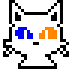

#  Hello, my name is Óscar Gómez

### Computer Engineer in UCLM and Master in computer graphics, virtual reality and vidogames in URJC

I'm a junior software developer and with eager to learn

## Skills:

 

 

 
 

 
 

 

And more...

## Find me at:

## Contact me:
[-D14836?style=flat&logo=gmail&logoColor=white&labelColor=101010)](mailto:ogmonedero@gmail.com)

<!--
**Ecenys/Ecenys** is a ✨ _special_ ✨ repository because its `README.md` (this file) appears on your GitHub profile.

Here are some ideas to get you started:

- 🔭 I’m currently working on ...
- 🌱 I’m currently learning ...
- 👯 I’m looking to collaborate on ...
- 🤔 I’m looking for help with ...
- 💬 Ask me about ...
- 📫 How to reach me: ...
- 😄 Pronouns: ...
- ⚡ Fun fact: ...
-->
